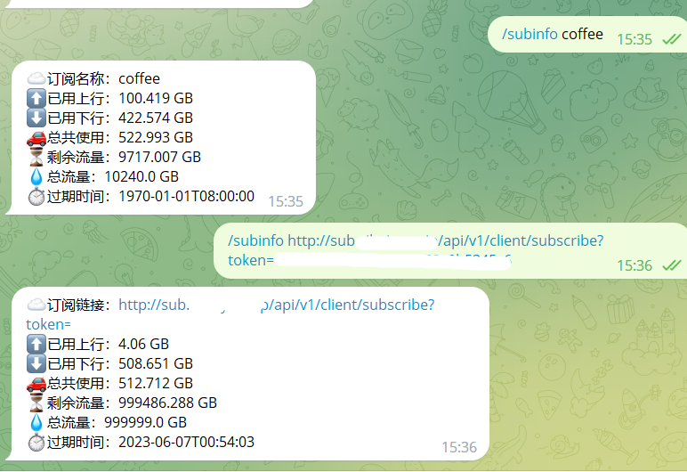

# /invite

### 解释

临时邀请一位telegram账户进行测试，对方无实际使用权限，仅限本次测试。对方被邀请后，将会出现一个消息框，引导对方点击邀请链接，选择测试类型，以及私聊给bot订阅链接，以进行测试。做完这些后，等到测试结果出现，整个流程结束。

### 用途

当您不想给太多人用户权限时，而对方又需要临时使用bot的测试功能，则可以使用此指令。

### 参数

```
/invite <回复一个目标> <任意流媒体名称1> <任意流媒体名称2>
```

3.6.0 加入的新变化：

```
/invite <任意流媒体名称1> <任意流媒体名称2>
```

```
<任意流媒体名称1> 指Bot所支持的所有英文名称（中文不行）测试脚本，像Netflix,Disney+,Youtube都是可以的。
```

### 使用

邀请回复自己：

```
/invite
```

### 特性

3.6.0新版特性：

invite不回复一个目标将默认邀请自己。

invite参数 <任意流媒体名称1> 将不再使用。


3.6.0以前：

invite需要回复一个目标，不这样做会提示需要回复一个目标。


#### 安全校验

Bot会校验用户身份，其他人点击邀请链接，会拒绝测试请求。

#### 超时机制

Bot拥有等待任务超时机制，超出60s后会取消任务认证，回收测试资源。

### 效果

发起邀请测试示意图：

<figure><figcaption></figcaption></figure>

目标接受邀请，使用示意图：

<figure><figcaption></figcaption></figure>

发送成功示意图：

<figure><figcaption></figcaption></figure>

超时效果示意图：

<figure><figcaption></figcaption></figure>

身份验证不通过示意图：

<figure><figcaption></figcaption></figure>
