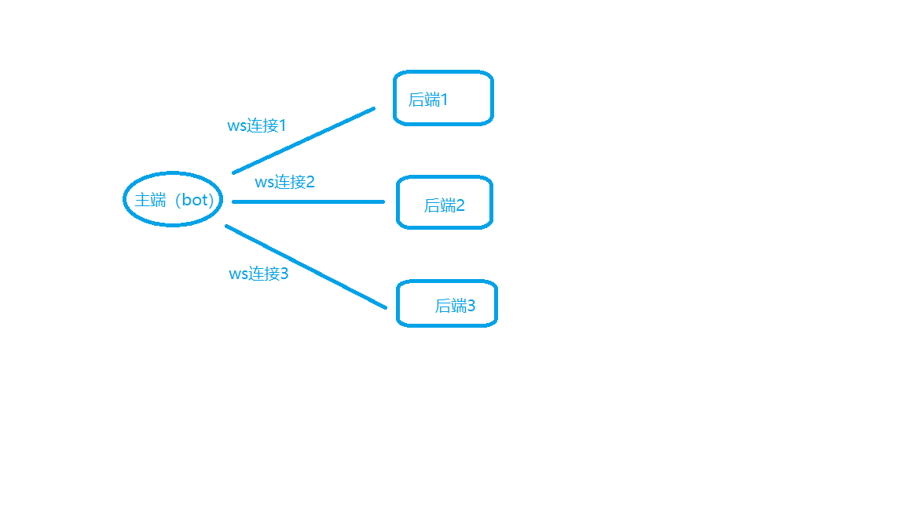
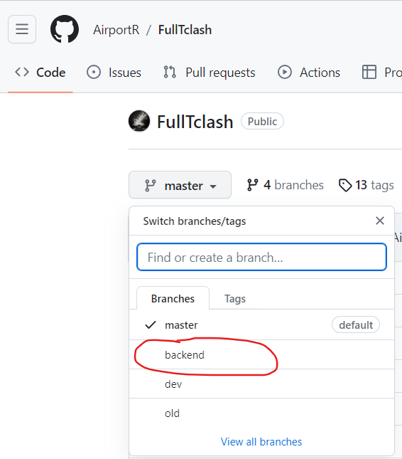

# WebSocket前后端模式说明


WebSocket协议是基于TCP的一种网络通信协议。 它实现了客户端与服务器全双工（full-duplex）通信，即允许服务器主动发送信息给客户端。 因此，在WebSocket中，浏览器和服务器只需要完成一次握手，两者之间就直接可以创建持久性的连接，并进行双向数据传输，客户端和服务器之间的数据交换变得更加简单。


在FullTclash中，它大概可以描述为这样子：

<figure><figcaption></figcaption></figure>

从主端（也就是从bot）那里接受到用户发起的测试请求时，bot会通过websocket主动连接到后端，给后端发送测试请求，返回等待后端回传结果。在此期间，双方保持长连接，直到其中有一方断开连接。


## 如何使用


**由于技术原因，目前支持ws对接的版本为Premium版本，即未开源的私人使用版本。**

如果您是忠实的开源的拥护者或者仅为个人使用，那么github仓库上的开源版本已经足够使用，它包含了premium版本的 95% 的特性。

如果您坚持要体验Premium版本，请继续往下阅读。

### 获取

您可以从FullTclash交流群（邀请链接在频道简介）中获取到premium版本

### 搭建


Premium版本为已经打包好的编译版本，意味着您不需要配置任何环境。首先需要解压，然后找到主程序二进制文件，通常是叫做 "FullTclash"。

然后同样需要一份配置文件（配置文件写法参见快速开始），接着跟其他二进制文件启动方式一样, ./FullTclash 启动即可，全程不需要安装python环境。


### 后端对接


基于websocket协议的后端目前支持两种类型，一种为FullTclash纯后端python实现，另一种是MiaoSpeed。

您可以前往MiaoSpeed项目地址进一步了解：



针对原始仓库，FullTclash项目组有它的fork仓库，该仓库的miaospeed将保持最大的兼容性：



关于对接Miaospeed后端到FullTclash主端，请参阅这篇文档：


[jiang-miaospeed-hou-duan-jie-ru-fulltclash.md](jiang-miaospeed-hou-duan-jie-ru-fulltclash.md)


接下来为FullTclash python实现的后端对接指南：

首先您需要搭建一个后端，这个后端所在的机器需要有公网ip或者内网穿透。

接着您需要前往本项目的backend分支拉取纯后端的运行代码：

<div align="center" data-full-width="true">

<figure><figcaption></figcaption></figure>

</div>

或者使用git：

```bash
git clone https://github.com/AirportR/FullTclash.git -b backend
```

启动后端的教程前往backend查看。很容易配置

启动好后，后端已经就绪，等到主端连接，主端需要配置一下后端的连接信息。

分为主端配置和后端配置，后端可以直接命令行启动，基础使用无需配置。

以下是一个对接ws后端的配置示例：

```yaml
slaveconfig:
  "slave1": #第一个后端，注意这里的名字是随便填的，是为了方便你该配置所标记的。
    address: 127.0.0.1:8765 #此项配置为websocket后端专属配置，当type为websocket时才有效。后端地址格式为 ip:port ，也可以是 域名:port。
    comment: "ws后端 [ws] [meta]" #后端备注，在测试图显示的。
    public-key: "12345678" #后端解密的通讯token，也叫做通信密钥，密钥不对无法对接成功。
    path: "/don't set a simple path"  #后端ws连接路径，默认为/ ，这里填配置里显示的路径。
    type: "websocket" #此项指明后端连接类型。仅有三个有效值：["websocket", "bot", "miaospeed"] 这里websocket后端。
```

在主端写上以上配置后，就可以在测试选择新的后端了。


### 问题答疑

1、websocket通信是否为明文：

答：通信过程全程加密，除非通讯密钥泄露。

2、是否支持启用TLS？

答：暂时不支持。目前已经有一层加密，未来将会跟进TLS。

3、是否支持IPV6后端？

答：需要配置DNS，也就是将域名添加一个AAAA记录，address那一栏填 域名:端口。

4、未来是否会开源websocket对接部分源码？

答：可能会、也有可能不会。在技术尚且不够成熟的时候，随意造的轮子可能让后端陷入危险境地。在互联网中，对网络通信应保持谨慎态度。

5、是否支持赞助？

答：很高兴您能看到最后，如果真的需要支持我，那您应该先了解我是怎样的人，亦或者我是谁？

比起赞助，我更希望您能给FullTclash一个star，以及改进它。等到1k star的那天，再说吧。


